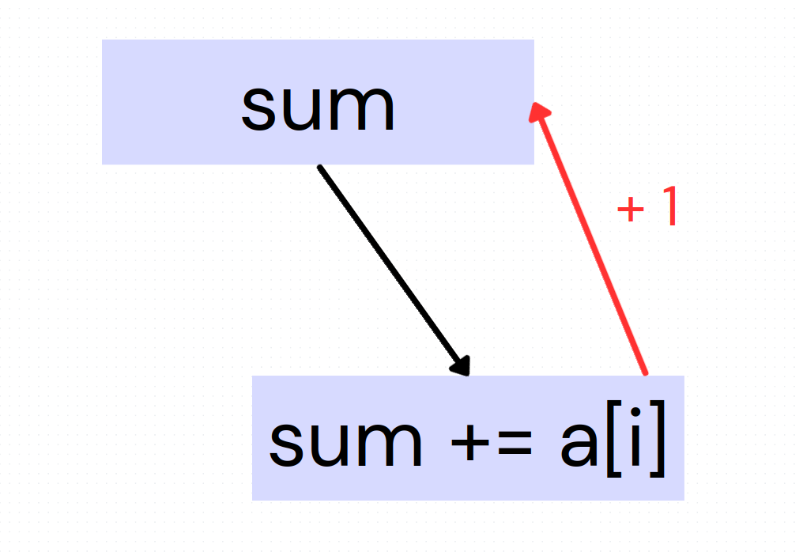
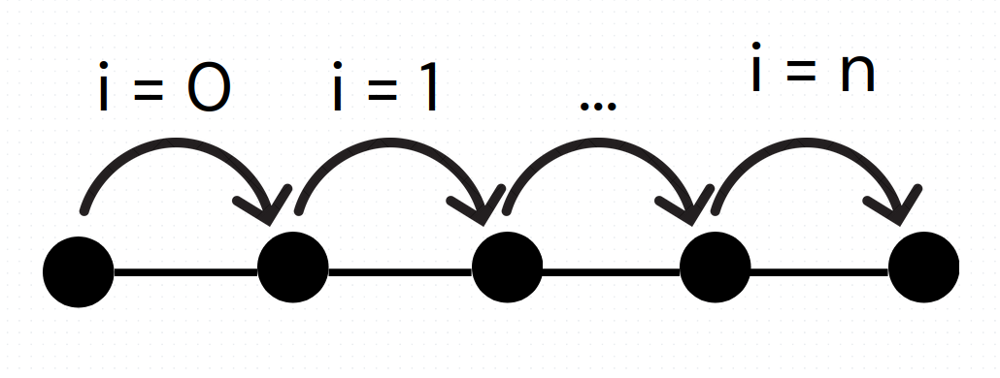

# TD 1 - report

## 1

### Graph

We rewrite the code :
    
    temp1 = a [i]
    temp2 = sum
    sum = temp1 + temp2

Iterations dependencies : linear, true dependance + output independance

### SIMD possibilities
There is no possibility to use vectorized operations here since all operations are dependent on the previous one.

However the compiler tells us :

    td1.1_vector_reduction.c:10:20: optimized: loop vectorized using 16 byte vectors
    td1.1_vector_reduction.c:21:7: optimized: basic block part vectorized using 16 byte vectors
    td1.1_vector_reduction.c:21:7: optimized: basic block part vectorized using 16 byte vectors

It restructures the code !

## 2

### The code

Without knowing main, the pointers could be equal or not (eg. : write a + b in a)