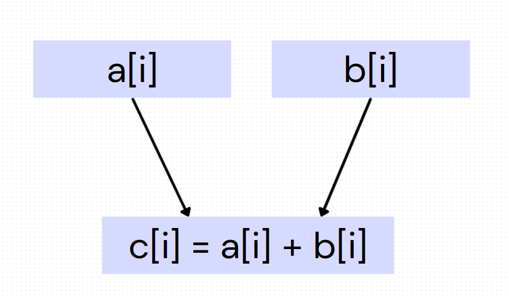

# TD 1 - report

## 1

### Graph

We rewrite the code :
    
    temp1 = a [i]
    temp2 = sum
    sum = temp1 + temp2

Iterations dependencies : linear, true dependance + output independance

### SIMD possibilities
There is no possibility to use vectorized operations here since all operations are dependent on the previous one.

However the compiler tells us :

    td1.1_vector_reduction.c:10:20: optimized: loop vectorized using 16 byte vectors
    td1.1_vector_reduction.c:21:7: optimized: basic block part vectorized using 16 byte vectors
    td1.1_vector_reduction.c:21:7: optimized: basic block part vectorized using 16 byte vectors

It restructures the code !

## 2

### The code

Without knowing main, the pointers could be equal or not (eg. : write a + b in a). They could even be offseted to part of the same array.

### Dependencies

If all the pointers points to independant array

But many other more complex cases can occur (equals, offset, etc.) !

### compilation

When we compile, the compiler tells us the following

    td1.2_vector_addition.c:10:20: optimized: loop vectorized using 16 byte vectors
    td1.2_vector_addition.c:10:20: optimized:  loop versioned for vectorization because of possible aliasing
    td1.2_vector_addition.c:10:20: optimized: loop vectorized using 8 byte vectors
    td1.2_vector_addition.c:34:7: optimized: basic block part vectorized using 16 byte vectors
    td1.2_vector_addition.c:34:7: optimized: basic block part vectorized using 16 byte vectors
    td1.2_vector_addition.c:35:7: optimized: basic block part vectorized using 16 byte vectors
    td1.2_vector_addition.c:35:7: optimized: basic block part vectorized using 16 byte vectors

When analyzing the code with objdump, the following stands out

    c[i] = a[i] + b[i];
    1328:	f3 0f 7e 04 8e       	movq   (%rsi,%rcx,4),%xmm0
    132d:	f3 0f 7e 0c 8a       	movq   (%rdx,%rcx,4),%xmm1
    1332:	66 0f fe c1          	paddd  %xmm1,%xmm0
    1336:	66 0f d6 04 8f       	movq   %xmm0,(%rdi,%rcx,4)

As we can see, the compiler makes benefit of the vectorized operations

When we run the program, these instructions are indeed used.

# 3

## Compilation

The first command (-fopt-info-vec-optimized) didn't give any message at all.

The second (-fopt-info-vec-missed) gives us many output messages. Extract :

    td1.3_matrix_vector_multiply.c:19:20: missed: couldn't vectorize loop
    td1.3_matrix_vector_multiply.c:23:28: missed: not vectorized: complicated access pattern.
    td1.3_matrix_vector_multiply.c:21:22: missed: couldn't vectorize loop
    td1.3_matrix_vector_multiply.c:23:25: missed: not vectorized: relevant stmt not supported: _10 = _4 * _8;
    td1.3_matrix_vector_multiply.c:32:20: missed: couldn't vectorize loop
    td1.3_matrix_vector_multiply.c:36:17: missed: statement clobbers memory: _1 = rand ();
    td1.3_matrix_vector_multiply.c:34:22: missed: couldn't vectorize loop
    td1.3_matrix_vector_multiply.c:36:17: missed: statement clobbers memory: _1 = rand ();
    td1.3_matrix_vector_multiply.c:36:17: missed: statement clobbers memory: _1 = rand ();
    td1.3_matrix_vector_multiply.c:45:20: missed: couldn't vectorize loop
    Elapsed...

The code is apparently too complex for the compiler to vectorize it.
The proble is in fact that the access are not contiguous in memory. So to vectorize it one would need to first move all the data in a contiguous memory space, and the permform computation on it, which is worse than just compute each separately in terms of time.

    for(int i = 0; i < SIZE; i++ )
    {
        for(int j = 0; j < SIZE; j++ )
        {
            d[j][i] = m[j][i] * v[i];
        }
    }

## Optimization

Simply by changin the order of the two loops (which result in the same d matrix since its independant)

    void matrix_vector_multiply(matrix_t d, matrix_t m, vector_t v)
    {
        for(int j = 0; j < SIZE; j++ )
        {
            for(int i = 0; i < SIZE; i++ )
            {
                d[j][i] = m[j][i] * v[i];
            }
        }
    }

Now the second loop could be vectorized, since all th "i" are contiguous in memory.

Let's compile it, and see the compiler's output:

    td1.3_matrix_vector_multiply_b.c:21:22: optimized: loop vectorized using 16 byte vectors
    td1.3_matrix_vector_multiply_b.c:21:22: optimized:  loop versioned for vectorization because of possible aliasing

## Comparison

| Optimization Type | N° of instructions executed |
|-------------------|----------------|
| Non-Vectorized    | 415,493,196    |
| Vectorized        | 414,935,184    |

As we can see, the vectorized version allow to save around 0.13% of the instructions (which is very few). For this program, according to Amdahl's law, vectorization is not very useful.

Moreover, as we can see in valgrinf outputs, most if the gain is not inherently due to vectorization, but to data cache hits.